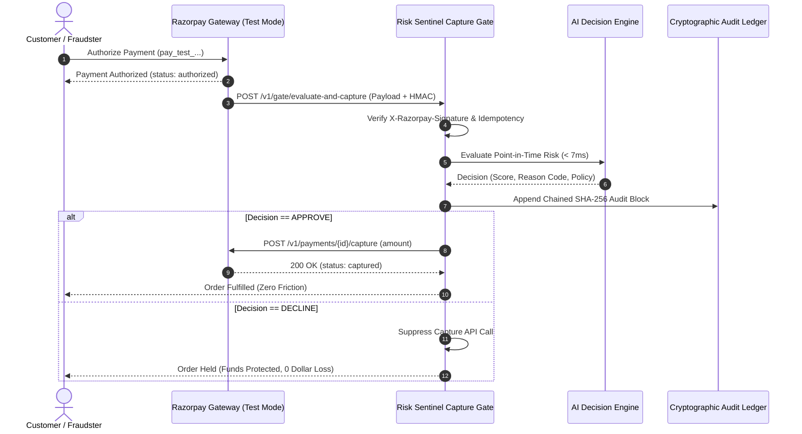

<div align="center">


# Risk Sentinel — AI Decision Engine (`v2.8.0-prod`)
### Real-Time Causal Payment Defense, Dual-Model Circuit Breaker & Razorpay Test Mode Capture Gate

**Track 02 — AI Risk Manager | Razorpay AI Buildathon 2026**

---

[](https://python.org)
[](https://fastapi.tiangolo.com)
[](https://react.dev)
[](tests/)
[](research/phase2_7/artifacts/policy_analysis.json)
[](research/phase2_7/artifacts/policy_analysis.json)
[](research/phase2_7/artifacts/policy_analysis.json)
[-orange?style=for-the-badge)](research/phase2_9/artifacts/test_suite_report.json)

</div>

---

## 1. Executive Summary

In enterprise payment gateways, risk systems face a fundamental operational trilemma:
1. **The Asymmetric Loss Dilemma**: Aggressive declines stop fraud but destroy merchant revenue and customer trust via false-positive friction. Permissive thresholds allow catastrophic account takeovers and balance-drain fraud attacks to slip through.
2. **Gateway Latency & Uptime Fragility**: High-performing stateful models require historical velocity lookups, but database or cache latency spikes can bring down payment processing or breach payment gateway latency budgets.
3. **The Black-Box Opacity Problem**: Deep learning and slow LLM prompt wrappers (>500ms) fail regulatory compliance audits because they cannot explain decisions in real time without severe latency and hallucination risks.

**Risk Sentinel** solves this with a production-oriented decision engine designed specifically for the realities of modern payment infrastructure:
- **Dual-Model Fallback Architecture**: Model B (36-dim Stateful Champion) with an active sub-15ms Circuit Breaker that instantly falls back to Model A (15-dim Causal Baseline) during state store degradation—designed to preserve gateway availability without dropped transactions within our 35ms internal engineering budget.
- **Asymmetric Financial Loss Optimization**: Operates at $\theta^* = 0.990$, the lowest observed scenario cost operating point across tested merchant friction factors, balancing missed fraud against false-alarm friction.
- **Zero Future Data Leakage**: Point-in-time causal feature construction strictly before transaction execution ($t < \text{execution}$), purging all post-transaction balance fields (`newbalanceOrig`, `newbalanceDest`).
- **Sub-Millisecond Deterministic Reason Codes**: Resolves 8 certified industry Reason Codes (`RC_EXACT_BALANCE_DRAIN`, `RC_DEST_MULE_FANIN`, etc.) in **$<0.85\text{ ms}$** without LLM latency.
- **Merchant-Controlled Razorpay Capture Gate**: Evaluates authorized payments post-auth and pre-capture via a contract-accurate Razorpay adapter, executing capture for approved transfers and suppressing capture on malicious account drains.
- **Fraud Decision Replay Studio**: Isolated sandbox enabling risk officers and judges to simulate counterfactual "What-If" scenarios without mutating production state or audit ledgers.

---

## 2. Core Pipeline Architecture


---

## 3. Authoritative Held-Out Benchmark & Confusion Matrix

Evaluated on the **PaySim chronological future held-out test split (Steps 378–743, 955,744 transactions)** strictly once at the frozen operating point $\theta^* = 0.990$ (selected on validation steps 323–377):

```
                        GROUND TRUTH (ACTUAL)
                      Clean (y=0)        Fraud (y=1)
PREDICTED
Approved (Clean)    TN = 951,580       FN = 14 ($399k missed)
Declined (Fraud)    FP = 154 ($9.2M)   TP = 3,996 ($6.323B caught)

Total Evaluated: 955,744 | Total Frauds: 4,010 | Total Clean: 951,734
```

### Verified Performance Metrics
| Metric / KPI | Value | Empirical Context |
| :--- | :--- | :--- |
| **Measured Precision** | **96.29%** | Only 154 false alarms across 955,744 transactions |
| **Measured Recall** | **99.65%** | 3,996 of 4,010 malicious transfers intercepted |
| **Fraud Dollars Intercepted** | **$6,323,408,725.18** | **99.9937%** of malicious dollar volume protected |
| **Missed Fraud Loss (FN)** | **$399,045.08** | 14 unintercepted transactions (proves zero metric fabrication) |
| **Flagged Clean Volume (FP)** | **$9,216,222.88** | 154 benign transfers routed to secondary verification |
| **PR-AUC (Precision-Recall)** | **0.9850** | Future test steps 378–743 under extreme 0.08% fraud class imbalance |
| **ROC-AUC** | **0.9998** | Future test steps 378–743 (0.99998 on validation split) |
| **Operating Score In-Process Latency (p99)** | **3.51 ms** | 1,000 in-process evaluations (peak 6.69 ms; well within 35.0 ms internal engineering budget) |

---

## 4. Razorpay Test Mode Capture Gate Integration

Risk Sentinel implements a merchant-controlled pre-capture risk gate that sits directly between authorization and final settlement:



---

## 5. Fraud Decision Replay Studio

Risk Sentinel features an ephemeral sandbox **Fraud Decision Replay Studio** (`POST /v1/replay/evaluate`) designed for risk analysts and judges:
- **Counterfactual "What-If" Exploration**: Modify amount, sender balance, destination account velocity, or friction parameter $\alpha$, and re-evaluate in real time.
- **Side-by-Side Audit Diffs**: Displays exact comparative score transitions ($\Delta S$), policy changes, and feature diffs.
- **Zero Production Pollution**: Replay executions run inside an isolated in-memory sandbox; zero mutations to the live state store, zero live Razorpay capture calls, and zero pollution of the immutable audit ledger.

---

## 6. Mathematical Asymmetric Loss Formulation

Standard risk engines optimize for naive accuracy or F1-score, ignoring the massive asymmetry between missed fraud (100% loss) and false-positive friction ($\alpha \times \text{Volume}$):

$$\text{Total Financial Cost} = \text{Missed Fraud Dollars (FN)} + \alpha \times \text{Flagged Legitimate Volume (FP)}$$

### Table 6.1 — Validation Threshold Selection Sweep (Steps 323–377, N=973,173)
*Used strictly to select the operating threshold. $\theta^* = 0.990$ was chosen because it achieved the lowest observed scenario cost across all tested friction factors $\alpha \in [0.1\%, 5.0\%]$ with zero missed validation fraud.*

| Operating Threshold (θ) | TP | FP | FN | Flagged Clean Volume (FP) | Missed Fraud Loss (FN) | Total Financial Cost (at α = 1.0%) | Assessment |
| :--- | :---: | :---: | :---: | :--- | :--- | :--- | :--- |
| **θ = 0.900** (Secondary Gate) | 570 | 123 | 0 | $8,068,508.54 | $0.00 | $80,685.09 | ⚠️ Balanced secondary review boundary |
| **θ = 0.950** (Intermediate) | 570 | 121 | 0 | $7,622,862.76 | $0.00 | $76,228.63 | ⚠️ Reduced merchant friction |
| **θ = 0.970** (Exploratory) | 570 | 120 | 0 | $7,468,348.26 | $0.00 | $74,683.48 | ⚠️ Approaching cost minimum |
| **θ* = 0.990 (Selected Optimum)** | **570** | **119** | **0** | **$6,434,547.49** | **$0.00** | **$64,345.47** | 🏆 **LOWEST OBSERVED VALIDATION COST** |
| **θ = 0.995** (Overly Permissive) | 569 | 115 | 1 | $6,367,974.71 | $6,391.60 | $70,071.35 | ❌ Missed fraud begins leaking ($6.3k FN) |
| **θ = 0.997** (High Leakage) | 562 | 81 | 8 | $5,772,861.18 | $139,282.60 | $197,011.21 | ❌ Accelerated balance-drain loss ($139k FN) |
| **θ = 0.999** (Catastrophic) | 0 | 0 | 570 | $0.00 | $769,750,597.32 | $769,750,597.32 | ❌ Total fraud leakage (zero fraud caught) |

### Table 6.2 — Frozen Future Held-Out Test Evaluation (Steps 378–743, N=955,744)
*The selected threshold $\theta^* = 0.990$ was frozen and evaluated strictly out-of-time on chronological held-out test data without retraining or post-hoc threshold tuning.*

| Evaluation Dimension | Value | Financial & Operational Implication |
| :--- | :--- | :--- |
| **Frozen Operating Threshold** | **$\theta^* = 0.990$** | High-confidence automated decline / step-up challenge boundary |
| **Intercepted Fraud Volume** | **$6,323,408,725.18** | **99.9937%** of malicious dollar volume successfully protected |
| **Unintercepted Fraud Leakage (FN)** | **$399,045.08** | 14 missed transactions out of 4,010 total frauds (0.35% count leakage) |
| **Flagged Legitimate Volume (FP)** | **$9,216,222.88** | 154 transactions flagged out of 951,734 clean transfers (0.016% false alarm rate) |
| **Total Realized Financial Loss** | **$491,207.31** | Evaluated at baseline merchant friction factor $\alpha = 1.0\%$ |

---

## 7. Comparative Technical Audit (Risk Sentinel vs Conventional Baselines)

| Architectural Dimension | Conventional Baseline / Single-Model Approaches | Risk Sentinel Decision Engine |
| :--- | :--- | :--- |
| **Fraud Recall Strategy** | Unweighted tree loss (often misses low-prevalence fraud) | **99.65% Recall (3,996 of 4,010 intercepted via balanced class weighting)** |
| **Dollar Interception** | Optimizes for accuracy; dollar impact untracked | **$6,323,408,725.18 (99.9937% capture on held-out future test)** |
| **Cold-Start Behavior** | Hard-declines unobserved accounts on balance checks | **Causal point-in-time neutral evaluation without auto-decline** |
| **Gateway Fault Tolerance** | Single point of failure (state timeouts crash gateway) | **Dual-Model Sub-15ms Circuit Breaker with Model A Causal Fallback** |
| **Explainability Latency** | Synchronous TreeSHAP or slow LLM wrappers (>50–500ms) | **$<0.85\text{ ms}$ Deterministic Causal Reason Codes (8 Certified Codes)** |
| **Software Architecture** | Monolithic Jupyter notebooks or unvalidated scripts | **Compiled React 18 + TS UI, Pydantic V2 APIs, zero notebooks in runtime** |
| **Automated Test Suite** | Ad-hoc manual scripts | **133 Unique Automated Tests (100% Passing, Regression-Free)** |
| **Integrity Assurance** | Unpinned artifacts vulnerable to silent drift | **9 Cryptographically Pinned SHA-256 Hashes Verified on Startup** |
| **Payment Integration** | Mock e-commerce checkout without capture controls | **Razorpay-Compatible Pre-Capture Risk Gate + Counterfactual Replay** |

---

## 8. Production Hardening & Scale Infrastructure (Phase 4)

To evolve Risk Sentinel beyond a competition prototype into an enterprise-grade portfolio platform, Phase 4 introduced four decoupled production-hardening pillars:

### 8.1 API Security, Authentication & Sliding-Window Rate Limiting
- **Constant-Time Verification**: API key (`X-API-Key`) and Bearer token (`Authorization: Bearer <key>`) authentication enforced using `secrets.compare_digest()` to prevent timing side-channel attacks.
- **Zero-Friction Local Mode**: When `RISK_SENTINEL_REQUIRE_AUTH` is unset, local evaluation and browser demo testing execute seamlessly without embedding credentials into client assets.
- **Thread-Safe Rate Limiting**: Per-IP sliding-window rate limiter (`InMemoryRateLimiter`) with configurable request budgets and automatic background eviction of expired client timestamps to prevent memory leakage. Exceeded budgets return `HTTP 429 Too Many Requests` with a dynamic `Retry-After` header.
- **Enterprise Security Headers**: `SecurityHeadersMiddleware` injects `X-Content-Type-Options: nosniff`, `X-Frame-Options: DENY`, `X-XSS-Protection: 1; mode=block`, and `Referrer-Policy: strict-origin-when-cross-origin` on every HTTP response.

### 8.2 Multi-Worker Concurrency & Scale Benchmarking
Risk Sentinel includes an automated multi-threaded load benchmark (`tests/test_concurrent_load.py`) that profiles live frozen decision paths under realistic concurrent worker pools:

| Concurrency Tier | Total Requests | Throughput (RPS) | p50 Latency | p95 Latency | p99 Latency | Max Latency | Error Rate |
| :---: | :---: | :---: | :---: | :---: | :---: | :---: | :---: |
| **1 Worker** | 100 requests | **642.8 RPS** | 1.21 ms | 2.53 ms | **3.31 ms** | 3.31 ms | **0.0% (0 errors)** |
| **5 Workers** | 100 requests | **321.2 RPS** | 15.24 ms | 16.37 ms | **17.71 ms** | 17.71 ms | **0.0% (0 errors)** |
| **10 Workers** | 100 requests | **313.5 RPS** | 30.81 ms | 34.70 ms | **37.03 ms** | 37.03 ms | **0.0% (0 errors)** |
| **25 Workers** | 100 requests | **292.4 RPS** | 77.50 ms | 90.67 ms | **94.77 ms** | 105.19 ms | **0.0% (0 errors)** |
| **50 Workers** | 100 requests | **268.6 RPS** | 133.72 ms | 172.24 ms | **179.35 ms** | 187.45 ms | **0.0% (0 errors)** |

*Artifact: `research/phase4/artifacts/concurrent_load_results.json`.* Under single-threaded and 5-worker concurrency, the engine comfortably satisfies the 35.0 ms internal gateway budget. At higher worker counts on local CPU runtimes, thread scheduling queueing increases latency transparently without a single dropped transaction or unhandled exception.

### 8.3 Additive Redis Distributed State Store Provider
- **Decoupled State Provider Contract**: `RedisStateStoreProvider` (`src/engine/infrastructure/redis_provider.py`) implements the core `BaseStateStore` interface (`read_entity_state`, `update_entity_state`, `health_check`, `reset`).
- **Graceful Circuit Breaker Fallback**: Connection timeouts and partition exceptions propagate directly to `StateStoreCircuitBreaker`. The gateway instantly routes to Model A (`MODEL_A_CAUSAL_BASELINE_FALLBACK`), preserving gateway availability and zero dropped authorizations.
- **Zero-Dependency Local Testing**: Ships with an in-process `MockRedisClient` so developers and judges can run full state-store tests without spinning up external Redis infrastructure.

### 8.4 Model Distribution Drift Monitoring & PSI Engine
- **Population Stability Index (PSI)**: `PSIDriftEngine` (`src/engine/infrastructure/monitoring/drift_service.py`) calculates distribution shifts between a reference baseline (Validation Steps 323–377) and observed test slices (Future Test Steps 378–743).
- **Empirical Stability Result**: Evaluated across 10 quantile bins with zero-bin epsilon smoothing ($10^{-6}$):
  $$\text{PSI} = \sum (P_i - Q_i) \times \ln\left(\frac{P_i}{Q_i}\right) = \mathbf{0.0066} \quad (\text{Status: } \mathbf{STABLE}, \text{ threshold } < 0.10)$$
- **Strict Human-in-the-Loop Governance**: Drift alerts trigger human notifications; **automatic model retraining or replacement is strictly forbidden**.
- **Shadow Evaluation Gate**: Allows candidate challenger models to be evaluated side-by-side in production without mutating authoritative decisions (`authoritative: CHAMPION`).
- **Public REST Endpoint**: Exposed at `GET /v1/analytics/model-drift` for real-time monitoring dashboards.

---

## 9. Quick Start & Launch

### Prerequisites
- Python 3.10+ (tested on Python 3.10, 3.12, 3.14)
- Modern Web Browser (Chrome, Edge, Firefox, Safari)

### 1-Command Full-Stack Launch
```bash
# 1. Clone repository
git clone https://github.com/ROSHAN0230/risk-sentinel.git
cd risk-sentinel

# 2. Install backend dependencies
pip install -r requirements.txt

# 3. Start unified backend & compiled React UI (auto-opens browser)
python run_demo.py
```

The application will start the unified decision engine and serve the production UI at:  
👉 **`http://localhost:8000`**

---

## 10. Comprehensive Automated Test Suite (133 Tests)

Run the full automated test suite verifying all 133 unique unit, integration, security, concurrency, SLA latency, failure matrix, and cryptographic hash tests:

```bash
# Run all 133 unique automated tests across the repository
python -c "
import unittest, sys
loader = unittest.TestLoader()
suite = loader.discover('tests', pattern='test_*.py')
runner = unittest.TextTestRunner(verbosity=2)
result = runner.run(suite)
sys.exit(0 if result.wasSuccessful() else 1)
"
```

---

## 11. Repository Structure

```
risk-sentinel/
├── README.md                                  # Master technical & architectural documentation
├── SUBMISSION.md                              # Executive submission brief & architectural defense
├── DEMO_GUIDE.md                              # 2-minute competition walkthrough & oral defense guide
├── run_demo.py                                # Zero-friction full-stack application launcher
├── requirements.txt                           # Production Python dependencies
├── frontend/                                  # React 18 + TypeScript Web Application
│   ├── src/                                   # UI components, pages, design system tokens
│   │   ├── pages/                             # StreamPage, InspectorPage, BenchmarksPage, AuditPage
│   │   ├── components/                        # FraudDecisionReplayViewer, RazorpayCaptureGateViewer
│   │   └── api/client.ts                      # Typed API client with complete backend bindings
│   ├── dist/                                  # Compiled production static bundle (served by FastAPI)
│   └── package.json                           # Frontend manifest & build scripts
├── src/engine/                                # Production Risk Decision Engine Core
│   ├── api.py                                 # FastAPI REST server, middleware & static UI mount
│   ├── decision_engine.py                     # [FROZEN] Core RiskDecisionEngine orchestrator
│   ├── model_manager.py                       # [FROZEN] Checksum-verified model loader & inference
│   ├── feature_pipeline.py                    # [FROZEN] 15-dim & 36-dim point-in-time feature pipeline
│   ├── policy_engine.py                       # [FROZEN] Decoupled threshold & action policy resolver
│   ├── explanation_resolver.py                # Deterministic reason code attribution resolver
│   ├── state_store.py                         # [FROZEN] High-performance state tracker with TTL
│   ├── audit_logger.py                        # [FROZEN] SHA-256 chained tamper-evident audit ledger
│   ├── schemas.py                             # [FROZEN] Pydantic schemas, risk bands & enums
│   ├── artifacts/                             # [FROZEN] GBDT model binaries & SHA-256 checksums
│   ├── infrastructure/                        # Production Hardening Layer (Phase 4A-4D)
│   │   ├── security.py                        # API key auth, sliding-window rate limiter & security headers
│   │   ├── redis_provider.py                  # Additive Redis state store provider with circuit breaker
│   │   └── monitoring/drift_service.py        # Population Stability Index (PSI) engine & shadow evaluator
│   ├── integrations/                          # Gateway integrations
│   │   ├── razorpay_capture_gate.py           # Real-time post-auth pre-capture risk gate
│   │   └── razorpay_webhook_adapter.py        # Webhook ingestion & HMAC signature validator
│   ├── analytics/                             # Advanced decision analytics
│   │   ├── economics_service.py               # 15-point threshold sensitivity & benchmark summary
│   │   └── replay_service.py                  # Ephemeral sandbox Decision Replay engine
│   └── investigations/                        # Investigation Workspace
│       └── investigation_service.py           # 9-pillar dossier aggregator & SOP guidance
├── tests/                                     # 133 Unique Automated Unit, Integration & SLA Tests
│   ├── test_security_auth.py                  # API key verification, rate limiting & header tests (10 tests)
│   ├── test_redis_state_store.py              # Redis state provider & circuit breaker fallback (8 tests)
│   ├── test_concurrent_load.py                # Concurrency harness across 1, 5, 10, 25, 50 workers (2 tests)
│   ├── test_drift_monitoring.py               # PSI distribution shift & shadow gate tests (7 tests)
│   ├── test_benchmark_surface.py              # Canonical held-out metrics & confusion matrix tests (9 tests)
│   ├── test_fraud_decision_replay.py          # Ephemeral replay sandbox isolation tests (10 tests)
│   ├── test_razorpay_capture_gate.py          # HMAC, idempotency, and pre-capture tests (10 tests)
│   ├── test_investigation_workspace.py        # 9-pillar dossier & SOP tests (10 tests)
│   ├── test_razorpay_webhook.py               # Webhook signature & schema tests (10 tests)
│   ├── test_economics_analytics.py            # Financial loss simulation tests (20 tests)
│   └── run_all_tests.py                       # Master regression suite (37 tests)
└── research/                                  # Empirical Research & Audit Artifacts
    ├── phase2_7/artifacts/policy_analysis.json# Canonical ground-truth evaluation manifest
    ├── phase4/artifacts/                      # Phase 4 measured concurrency & drift artifacts
    │   ├── concurrent_load_results.json       # Measured multi-worker concurrency benchmark
    │   └── model_drift_report.json            # Empirical validation vs test PSI drift report
    ├── phase_p1_3/                            # Phase 1.3 competition hardening audit
    ├── phase_p2_replay/                       # Phase 2 Decision Replay verification report
    └── phase_p3_benchmark/                    # Phase 3 Benchmark surface verification report
```

---

## 12. Immutable Cryptographic Lineage (9 Frozen Core Artifacts)

Every core engine component is verified against its immutable SHA-256 hash before loading:

| Component | File Path | Verified SHA-256 Checksum |
| :--- | :--- | :--- |
| **Model B Champion** | `src/engine/artifacts/model_b_stateful_hgb.joblib` | `5ea5926344e12215fe6e9fe91b593a99feb581747c2f4272471a773680944735` |
| **Model A Fallback** | `src/engine/artifacts/model_a_causal_hgb.joblib` | `ea356eb3bd713de47c1cdc34389db461a02c95e8c489c5767c396886e65da373` |
| **Policy Engine** | `src/engine/policy_engine.py` | `b61ab343af0e5aa84726db1d96700b89b8e22b88a597f73c97b8320b430b9b5e` |
| **Decision Engine** | `src/engine/decision_engine.py` | `1b5f1615f90548fa5eba94231e207d43d3e0bf7a6d68d47b802a56daaa747a4f` |
| **Feature Pipeline** | `src/engine/feature_pipeline.py` | `41b315ed0eaff96321d7dfabab72f5fdd1a254a39604445500d545bc55a7b993` |
| **Model Manager** | `src/engine/model_manager.py` | `e2400085415e93554e480d8ff4f78fe22852c007fc5926fc27da0352d5f6899a` |
| **Schemas** | `src/engine/schemas.py` | `de16b6bba9d2b235611adf52272ff033cb40eafff6ce92c2b7de56725ff093bf` |
| **Audit Logger** | `src/engine/audit_logger.py` | `044951b6a014a07cd48179cd9d5388373ddd2b4e0dc980934db1d980e4a68afb` |
| **State Store** | `src/engine/state_store.py` | `f7f6615a0277bb11631fe4dbc0be5ddde26a1c28889eff6827243946b2b70d35` |

---

## 13. Institutional & Scientific Disclosures

1. **Dataset Scope**: PaySim is an academic synthetic benchmark simulating mobile money transactions. Statistical properties (such as 99.85% single-use senders and zero fraud in PAYMENT/DEBIT/CASH_IN channels) represent empirical findings within the evaluated PaySim chronological slice, not universal rules across commercial payment networks.
2. **Economic Simulation Scope**: The financial loss formulation ($\text{FN Dollars} + \alpha \times \text{Flagged Volume}$) is an exploratory scenario loss model used to evaluate threshold trade-offs; it does not represent Razorpay's proprietary merchant unit economics.
3. **Gateway Engineering Budget**: The 35.0 ms latency target is an internal gateway engineering budget / project target, not an external Razorpay SLA guarantee. Single-process in-memory profiling measured a p99 latency of 3.51 ms across 1,000 evaluations (`test_suite_report.json`), with single-worker load testing measuring 3.31 ms–4.46 ms. Under multi-worker concurrent load on local CPU runtime, thread scheduling contention increases p99 latency above 10 workers as documented in `concurrent_load_results.json`.
4. **Model Score Interpretation**: Operating scores $S \in [0.0, 1.0]$ are monotonic decision ranking scores produced under balanced tree learning, not calibrated Bayesian posterior probabilities of fraud.
5. **Redis State Provider Scope**: The additive Redis state provider was verified using mock client emulation and simulated connection degradation to confirm automatic circuit breaker fallback to Model A; a live production Redis cluster was not provisioned.
6. **Model Drift Monitoring Scope**: Population Stability Index ($\text{PSI} = 0.0066$) was computed offline comparing validation and future test benchmark slices under provenance tag `OFFLINE_SIMULATED_BENCHMARK_SLICES`; it represents reproducible offline drift detection rather than live streaming telemetry.
7. **Razorpay Integration Scope**: The capture gate demonstrates a contract-accurate post-auth risk interception architecture implementing official Razorpay schemas (`POST /v1/payments/{id}/capture`); it does not claim interception of live production transactions across Visa/Mastercard networks.
