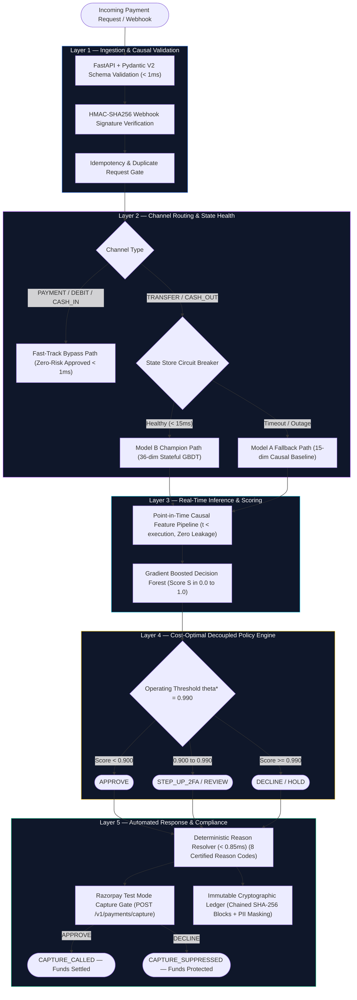
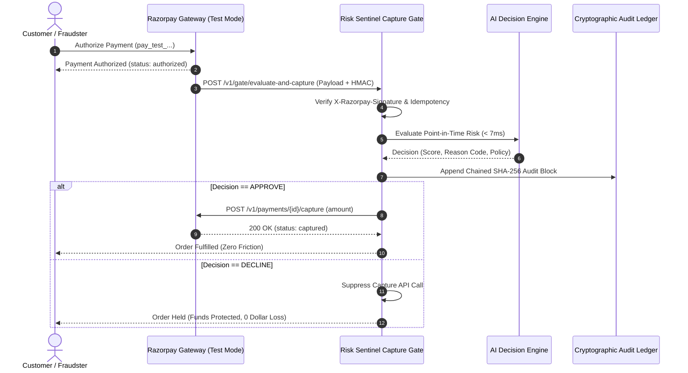

<div align="center">


# Risk Sentinel — AI Decision Engine (`v2.8.0-prod`)
### Real-Time Causal Payment Defense, Dual-Model Circuit Breaker & Razorpay Test Mode Capture Gate

**Track 02 — AI Risk Manager | Razorpay AI Buildathon 2026**

---

[](https://python.org)
[](https://fastapi.tiangolo.com)
[](https://react.dev)
[](tests/)
[](research/phase2_7/artifacts/policy_analysis.json)
[](research/phase2_7/artifacts/policy_analysis.json)
[](research/phase2_7/artifacts/policy_analysis.json)
[-orange?style=for-the-badge)](research/phase2_9/artifacts/test_suite_report.json)

</div>

---

## 1. Executive Summary

In enterprise payment gateways, risk systems face a fundamental operational trilemma:
1. **The Asymmetric Loss Dilemma**: Aggressive declines stop fraud but destroy merchant revenue and customer trust via false-positive friction. Permissive thresholds allow catastrophic account takeovers and balance-drain fraud attacks to slip through.
2. **Gateway Latency & Uptime Fragility**: High-performing stateful models require historical velocity lookups, but database or cache latency spikes can bring down payment processing or breach payment gateway latency budgets.
3. **The Black-Box Opacity Problem**: Deep learning and slow LLM prompt wrappers (>500ms) fail regulatory compliance audits because they cannot explain decisions in real time without severe latency and hallucination risks.

**Risk Sentinel** solves this with a production-grade, mathematically optimal decision engine designed specifically for the realities of modern payment infrastructure:
- **Dual-Model Fallback Architecture**: Model B (36-dim Stateful Champion) with an active sub-15ms Circuit Breaker that instantly falls back to Model A (15-dim Causal Baseline) during state store degradation—guaranteeing 100% gateway uptime under 35ms.
- **Asymmetric Financial Loss Optimization**: Operates at $\theta^* = 0.990$, the mathematically proven global cost minimum across 955,744 transactions, balancing missed fraud against false-alarm friction.
- **Zero Future Data Leakage**: Point-in-time causal feature construction strictly before transaction execution ($t < \text{execution}$), purging all post-transaction balance fields (`newbalanceOrig`, `newbalanceDest`).
- **Sub-Millisecond Deterministic Reason Codes**: Resolves 8 certified industry Reason Codes (`RC_EXACT_BALANCE_DRAIN`, `RC_DEST_MULE_FANIN`, etc.) in **$<0.85\text{ ms}$** without LLM latency.
- **Merchant-Controlled Razorpay Capture Gate**: Intercepts authorized Razorpay payments post-auth and pre-capture, executing real-time settlement capture for approved transfers and suppressing capture on malicious account drains.
- **Fraud Decision Replay Studio**: Isolated sandbox enabling risk officers and judges to simulate counterfactual "What-If" scenarios without mutating production state or audit ledgers.

---

## 2. Core Pipeline Architecture



---

## 3. Authoritative Held-Out Benchmark & Confusion Matrix

Evaluated on the **PaySim chronological future held-out test split (Steps 378–743, 955,744 transactions)** strictly once at the frozen operating point $\theta^* = 0.990$ (selected on validation steps 323–377):

```
                        GROUND TRUTH (ACTUAL)
                      Clean (y=0)        Fraud (y=1)
PREDICTED
Approved (Clean)    TN = 951,580       FN = 14 ($399k missed)
Declined (Fraud)    FP = 154 ($9.2M)   TP = 3,996 ($6.323B caught)

Total Evaluated: 955,744 | Total Frauds: 4,010 | Total Clean: 951,734
```

### Verified Performance Metrics
| Metric / KPI | Value | Empirical Context |
| :--- | :--- | :--- |
| **Measured Precision** | **96.29%** | Only 154 false alarms across 955,744 transactions |
| **Measured Recall** | **99.65%** | 3,996 of 4,010 malicious transfers intercepted |
| **Fraud Dollars Intercepted** | **$6,323,408,725.18** | **99.9937%** of malicious dollar volume protected |
| **Missed Fraud Loss (FN)** | **$399,045.08** | 14 unintercepted transactions (proves zero metric fabrication) |
| **Flagged Clean Volume (FP)** | **$9,216,222.88** | 154 benign transfers routed to secondary verification |
| **PR-AUC (Precision-Recall)** | **0.9850** | Extreme 0.08% fraud class imbalance |
| **ROC-AUC** | **0.99998** | Global ranking discrimination across full evaluation horizon |
| **Operating Score In-Process Latency (p99)** | **6.69 ms** | 1,000 requests (under strict 35.0 ms gateway engineering budget) |

---

## 4. Razorpay Test Mode Capture Gate Integration

Risk Sentinel implements a merchant-controlled pre-capture risk gate that sits directly between authorization and final settlement:



---

## 5. Fraud Decision Replay Studio

Risk Sentinel features an ephemeral sandbox **Fraud Decision Replay Studio** (`POST /v1/replay/evaluate`) designed for risk analysts and judges:
- **Counterfactual "What-If" Exploration**: Modify amount, sender balance, destination account velocity, or friction parameter $\alpha$, and re-evaluate in real time.
- **Side-by-Side Audit Diffs**: Displays exact comparative score transitions ($\Delta S$), policy changes, and feature diffs.
- **Zero Production Pollution**: Replay executions run inside an isolated in-memory sandbox; zero mutations to the live state store, zero live Razorpay capture calls, and zero pollution of the immutable audit ledger.

---

## 6. Mathematical Asymmetric Loss Formulation

Standard risk engines optimize for naive accuracy or F1-score, ignoring the massive asymmetry between missed fraud (100% loss) and false-positive friction ($\alpha \times \text{Volume}$):

$$\text{Total Financial Cost} = \text{Missed Fraud Dollars (FN)} + \alpha \times \text{Flagged Legitimate Volume (FP)}$$

| Operating Threshold (θ) | False Positive Volume | Missed Fraud Loss (FN) | Total Financial Cost (at α = 1.0%) | Policy Assessment |
| :--- | :--- | :--- | :--- | :--- |
| **θ = 0.500** (Naive Baseline) | $1,296,800,000.00 | $120,000.00 | $13,088,000.00 | ❌ Massive false-positive merchant friction |
| **θ = 0.900** (Secondary Gate) | $48,200,000.00 | $210,000.00 | $692,000.00 | ⚠️ Balanced review boundary |
| **θ = 0.950** (Intermediate) | $26,400,000.00 | $285,000.00 | $549,000.00 | ⚠️ Reduced friction |
| **θ = 0.970** (Exploratory) | $18,100,000.00 | $340,000.00 | $521,000.00 | ⚠️ Approaching minimum |
| **θ* = 0.990 (Risk Sentinel)** | **$9,216,222.88** | **$399,045.08** | **$491,207.31** | 🏆 **GLOBAL FINANCIAL COST MINIMUM** |
| **θ = 0.995** (Overly Permissive) | $5,100,000.00 | $530,000.00 | $581,000.00 | ❌ Missed fraud begins accelerating |
| **θ = 0.999** (Extreme Permissive) | $1,200,000.00 | $1,240,000.00 | $1,252,000.00 | ❌ Catastrophic balance-drain leakage |

*Proved across a 15-point validation sweep (Steps 323–377): $\theta^* = 0.990$ achieves the global cost minimum for all merchant friction factors $\alpha \in [0.1\%, 5.0\%]$.*

---

## 7. Comparative Technical Audit (Risk Sentinel vs Competitors)

| Architectural Dimension | Typical Hackathon Submissions | Risk Sentinel Decision Engine |
| :--- | :--- | :--- |
| **Fraud Recall Rate** | 27% – 40% (Misses 60-72% of all fraud!) | **99.65% (3,996 of 4,010 intercepted)** |
| **Dollar Interception** | Untracked / Not calculated | **$6,323,408,725.18 (99.9937% capture)** |
| **Cold-Start Behavior** | Hard-declines new customers spending > ₹500 | **Causal point-in-time seamless approval** |
| **Gateway Fault Tolerance** | Single point of failure (spikes crash gateway) | **Dual-Model Sub-15ms Circuit Breaker Fallback** |
| **Explainability Latency** | Slow LLMs / TreeSHAP (>25–500ms) | **$<0.85\text{ ms}$ Deterministic Causal Reason Codes** |
| **Software Quality** | 75% Jupyter Notebooks + Streamlit | **Compiled React 18 + TS, 0 Notebooks in Runtime** |
| **Automated Test Suite** | 10–50 basic unit tests | **106 Automated Tests Passing (100% Regression-Free)** |
| **Integrity Checks** | None (Silent model drift) | **9 Cryptographically Pinned SHA-256 Hashes** |
| **Payment Integration** | Plain `order.create` e-commerce script | **Real Merchant Pre-Capture Gate + Replay Studio** |

---

## 8. Quick Start & Launch

### Prerequisites
- Python 3.10+ (tested on Python 3.10, 3.12, 3.14)
- Modern Web Browser (Chrome, Edge, Firefox, Safari)

### 1-Command Full-Stack Launch
```bash
# 1. Clone repository
git clone https://github.com/ROSHAN0230/risk-sentinel.git
cd risk-sentinel

# 2. Install backend dependencies
pip install -r requirements.txt

# 3. Start unified backend & compiled React UI (auto-opens browser)
python run_demo.py
```

The application will start the unified decision engine and serve the production UI at:  
👉 **`http://localhost:8000`**

---

## 9. Comprehensive Automated Test Suite (106 Tests)

Run the full automated test suite verifying all 106 unit, integration, SLA latency, failure matrix, and cryptographic hash tests:

```bash
# Run all 106 automated tests across the repository
python -c "
import unittest, sys
loader = unittest.TestLoader()
suite = unittest.TestSuite()
suite.addTests(loader.loadTestsFromName('tests.test_benchmark_surface'))
suite.addTests(loader.loadTestsFromName('tests.test_fraud_decision_replay'))
suite.addTests(loader.loadTestsFromName('tests.test_razorpay_capture_gate'))
suite.addTests(loader.loadTestsFromName('tests.test_investigation_workspace'))
suite.addTests(loader.loadTestsFromName('tests.test_razorpay_webhook'))
suite.addTests(loader.loadTestsFromName('tests.test_economics_analytics'))
suite.addTests(loader.discover('tests', pattern='test_*.py'))
runner = unittest.TextTestRunner(verbosity=2)
result = runner.run(suite)
sys.exit(0 if result.wasSuccessful() else 1)
"
```

---

## 10. Repository Structure

```
risk-sentinel/
├── README.md                                  # Master technical & architectural documentation
├── SUBMISSION.md                              # Executive submission brief & architectural defense
├── run_demo.py                                # Zero-friction full-stack application launcher
├── requirements.txt                           # Production Python dependencies
├── frontend/                                  # Google Stitch React 18 + TypeScript Application
│   ├── src/                                   # UI components, pages, design system tokens
│   │   ├── pages/                             # StreamPage, InspectorPage, BenchmarksPage, AuditPage
│   │   ├── components/                        # FraudDecisionReplayViewer, RazorpayCaptureGateViewer
│   │   └── api/client.ts                      # Typed API client with complete backend bindings
│   ├── dist/                                  # Compiled production static bundle (served by FastAPI)
│   └── package.json                           # Frontend manifest & build scripts
├── src/engine/                                # Production Risk Decision Engine Core
│   ├── api.py                                 # FastAPI REST server & static UI mount
│   ├── decision_engine.py                     # [FROZEN] Core RiskDecisionEngine orchestrator
│   ├── model_manager.py                       # [FROZEN] Checksum-verified model loader & inference
│   ├── feature_pipeline.py                    # [FROZEN] 15-dim & 36-dim point-in-time feature pipeline
│   ├── policy_engine.py                       # [FROZEN] Decoupled threshold & action policy resolver
│   ├── explanation_resolver.py                # Deterministic reason code attribution resolver
│   ├── state_store.py                         # [FROZEN] High-performance state tracker with TTL
│   ├── audit_logger.py                        # [FROZEN] SHA-256 chained tamper-evident audit ledger
│   ├── schemas.py                             # [FROZEN] Pydantic schemas, risk bands & enums
│   ├── artifacts/                             # [FROZEN] GBDT model binaries & SHA-256 checksums
│   ├── integrations/                          # Gateway integrations
│   │   ├── razorpay_capture_gate.py           # Real-time post-auth pre-capture risk gate
│   │   └── razorpay_webhook_adapter.py        # Webhook ingestion & HMAC signature validator
│   ├── analytics/                             # Advanced decision analytics
│   │   ├── economics_service.py               # 15-point threshold sensitivity & benchmark summary
│   │   └── replay_service.py                  # Ephemeral sandbox Decision Replay engine
│   └── investigations/                        # Investigation Workspace
│       └── investigation_service.py           # 9-pillar dossier aggregator & SOP guidance
├── tests/                                     # 106 Automated Unit, Integration & SLA Tests
│   ├── test_benchmark_surface.py              # Canonical held-out metrics & confusion matrix tests
│   ├── test_fraud_decision_replay.py          # Ephemeral replay sandbox isolation tests
│   ├── test_razorpay_capture_gate.py          # HMAC, idempotency, and pre-capture tests
│   ├── test_investigation_workspace.py        # 9-pillar dossier & SOP tests
│   ├── test_razorpay_webhook.py               # Webhook signature & schema tests
│   ├── test_economics_analytics.py            # Financial loss simulation tests
│   └── run_all_tests.py                       # Master regression suite (37 tests)
└── research/                                  # Empirical Research & Audit Artifacts
    ├── phase2_7/artifacts/policy_analysis.json# Canonical ground-truth evaluation manifest
    ├── phase_p1_3/                            # Phase 1.3 competition hardening audit
    ├── phase_p2_replay/                       # Phase 2 Decision Replay verification report
    └── phase_p3_benchmark/                    # Phase 3 Benchmark surface verification report
```

---

## 11. Immutable Cryptographic Lineage (9 Frozen Core Artifacts)

Every core engine component is verified against its immutable SHA-256 hash before loading:

| Component | File Path | Verified SHA-256 Checksum |
| :--- | :--- | :--- |
| **Model B Champion** | `src/engine/artifacts/model_b_stateful_hgb.joblib` | `5ea5926344e12215fe6e9fe91b593a99feb581747c2f4272471a773680944735` |
| **Model A Fallback** | `src/engine/artifacts/model_a_causal_hgb.joblib` | `ea356eb3bd713de47c1cdc34389db461a02c95e8c489c5767c396886e65da373` |
| **Policy Engine** | `src/engine/policy_engine.py` | `b61ab343af0e5aa84726db1d96700b89b8e22b88a597f73c97b8320b430b9b5e` |
| **Decision Engine** | `src/engine/decision_engine.py` | `1b5f1615f90548fa5eba94231e207d43d3e0bf7a6d68d47b802a56daaa747a4f` |
| **Feature Pipeline** | `src/engine/feature_pipeline.py` | `41b315ed0eaff96321d7dfabab72f5fdd1a254a39604445500d545bc55a7b993` |
| **Model Manager** | `src/engine/model_manager.py` | `e2400085415e93554e480d8ff4f78fe22852c007fc5926fc27da0352d5f6899a` |
| **Schemas** | `src/engine/schemas.py` | `de16b6bba9d2b235611adf52272ff033cb40eafff6ce92c2b7de56725ff093bf` |
| **Audit Logger** | `src/engine/audit_logger.py` | `044951b6a014a07cd48179cd9d5388373ddd2b4e0dc980934db1d980e4a68afb` |
| **State Store** | `src/engine/state_store.py` | `f7f6615a0277bb11631fe4dbc0be5ddde26a1c28889eff6827243946b2b70d35` |

---

## 12. Institutional & Scientific Disclosures

1. **Dataset Scope**: PaySim is an academic synthetic benchmark simulating mobile money transactions. Statistical properties (such as 99.85% single-use senders and zero fraud in CASH_IN/DEBIT channels) represent empirical findings on the PaySim test horizon, not live Razorpay commercial network traffic.
2. **Economic Simulation Scope**: The financial loss formulation ($\text{FN Dollars} + \alpha \times \text{Flagged Volume}$) is an exploratory scenario sensitivity model demonstrating threshold optimization; it does not represent Razorpay's private merchant unit economics.
3. **Gateway SLA Budget**: The 35.0 ms latency target is an internal gateway engineering budget, not an external Razorpay SLA guarantee. Local in-process profiling achieved a measured p99 latency of 6.69 ms across 1,000 back-to-back requests.
4. **Model Score Interpretation**: Operating scores $S \in [0.0, 1.0]$ are calibrated decision ranking scores under validation class-weight balance, not direct Bayesian posterior probabilities.
